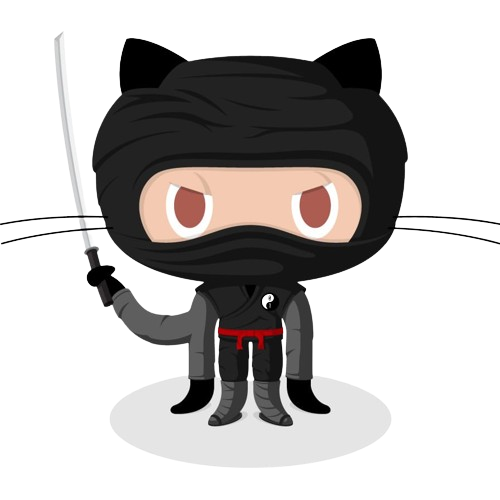

  
  <h1>Demir Özkan Official Website</h1>
  
  

    A simple blog theme focused on writing powered by Bulma and Zola.
  

  

<!-- About the Project -->
## :star2: About the Project

<!-- Screenshots -->
### :camera: Screenshots

 
  

 

 
  

<!-- TechStack -->
### :space_invader: Tech Stack

- [Zola](https://www.getzola.org/) - Your one-stop static site engine
- [Bulma](https://bulma.io/) - The modern CSS framework that just works. 

<!-- Features -->
### :dart: Features

- [x] Dark Mode
- [x] Pagination
- [x] Search
- [x] Charts
- [x] Maps
- [x] Diagrams
- [x] Galleria
- [x] Analytics
- [x] Comments
- [x] Categories
- [x] Social Links
- [x] Multilingual Navbar
- [x] Katex

<!-- License -->
## :warning: License

Distributed under the MIT License. See  `LICENSE` for more information.
