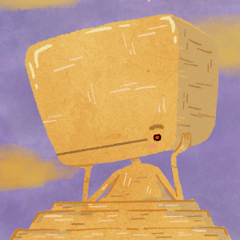
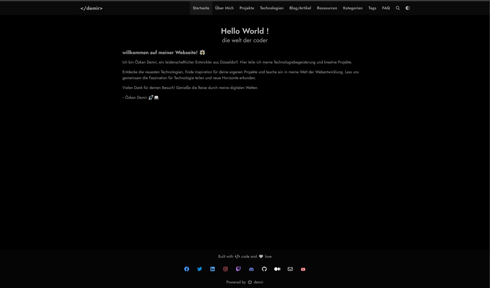
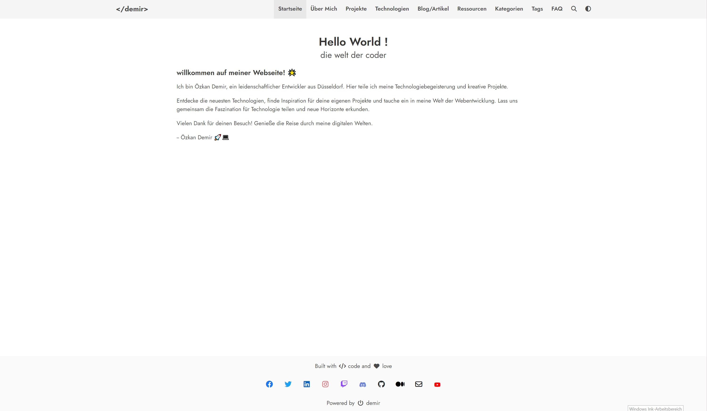

  
  <h1>DeepThought</h1>
  
  

    A simple blog theme focused on writing powered by Bulma and Zola.
  

  
  
<!-- Badges -->

  
  
  
  
  
  

   
<h4>
    <a href="https://github.com/RatanShreshtha/DeepThought/">View Demo</a>
   · 
    <a href="https://github.com/RatanShreshtha/DeepThought">Documentation</a>
   · 
    <a href="https://github.com/RatanShreshtha/DeepThought/issues/">Report Bug</a>
   · 
    <a href="https://github.com/RatanShreshtha/DeepThought/issues/">Request Feature</a>
  </h4>

   

<!-- About the Project -->
## :star2: About the Project

<!-- Screenshots -->
### :camera: Screenshots

 
  

 

 
  

<!-- TechStack -->
### :space_invader: Tech Stack

- [Zola](https://www.getzola.org/) - Your one-stop static site engine
- [Bulma](https://bulma.io/) - The modern CSS framework that just works. 

<!-- Features -->
### :dart: Features

- [x] Dark Mode
- [x] Pagination
- [x] Search
- [x] Charts
- [x] Maps
- [x] Diagrams
- [x] Galleria
- [x] Analytics
- [x] Comments
- [x] Categories
- [x] Social Links
- [x] Multilingual Navbar
- [x] Katex

<!-- License -->
## :warning: License

Distributed under the MIT License. See  `LICENSE` for more information.

<!-- Acknowledgments -->
## :gem: Acknowledgements

Use this section to mention useful resources and libraries that you have used in your projects.

- [Shields.io](https://shields.io/)
- [Choose an Open Source License](https://choosealicense.com)
- [Awesome README](https://github.com/matiassingers/awesome-readme)
- [Emoji Cheat Sheet](https://github.com/ikatyang/emoji-cheat-sheet/blob/main/README.md#travel--places)
- [Slick Carousel](https://kenwheeler.github.io/slick)
- [Font Awesome](https://fontawesome.com)
- [Unsplash](https://unsplash.com/)
# demir
